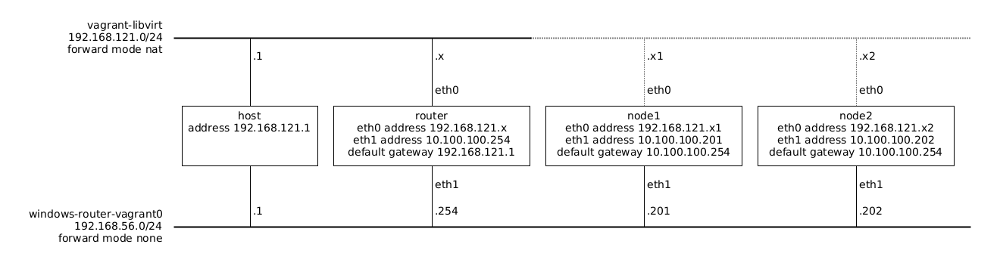

# About

This is an example windows router working in vagrant.

Vagrant VMs need to have a management network wich is NATted by the host,
but that makes it difficult to play with the windows router, so this essentially
adds a secondary network interface that is used for routing, and replaces the
adds a default route to use our router in `eth1`. So everything that would be
normally done at `eth0` must be done in `eth1`.

The network is setup as:



**NB** The dotted lines represent a network connection that is not directly used,
instead, the traffic in those nodes goes through `eth1` and is routed by the
`router` machine.

**NB** For a ansible managed environment see [rgl/windows-router-ansible-vagrant](https://github.com/rgl/windows-router-ansible-vagrant).

**NB** For a debian linux equivalent of this environment see
[rgl/debian-router-vagrant](https://github.com/rgl/debian-router-vagrant).

## Usage

Install the [base windows 2022 box](https://github.com/rgl/windows-vagrant).

Start this environment:

```bash
time vagrant up --provider=libvirt --no-destroy-on-error --no-tty
```

## Network Packet Capture

Login into the VM, install npcap (its on the Desktop), and run Wireshark.
